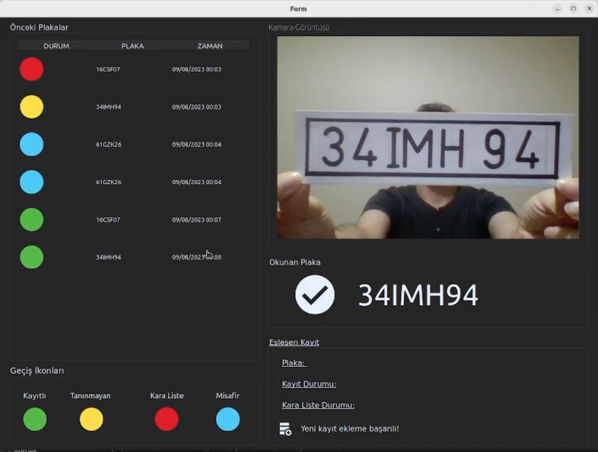

# License Plate Recognizer

License Plate Recognizer is an innovative project aimed at efficiently classifying license plates captured by cameras. The system performs a series of intelligent checks, including querying a database, to determine whether a recognized license plate belongs to a guest, a registered, an unknown or if it is blacklisted. This classification can be seamlessly managed through the user-friendly application interface.

## Features
- Classifies license plates into four categories: guest, unknown, registered, or blacklisted.
- Backend powered by Python 3.11.4 and OpenCV for robust image processing.
- Utilizes a MySQL database (via Docker) and PhpMyAdmin (via Docker) for efficient data management.
- Interactive and intuitive frontend developed using PyQt6.
- Implements a Machine Learning approach based on K-Nearest Neighbors (KNN) model to detect similar font styles in license plates.
- Custom trained models using transfer learning techniques for enhanced accuracy.
- Developed and optimized for Linux operating systems, specifically Ubuntu 22.04 LTS.

## How it Works
1. Captured license plate images are processed using Python and OpenCV to extract relevant information.
2. The KNN model identifies font styles similar to those found in license plates, and users manually input characters for recognition.
3. A custom model is trained using transfer learning, incorporating the collected data to improve recognition accuracy.
4. The application's intelligent backend analyzes the processed data, queries the MySQL database, and categorizes the license plate.
5. The frontend interface provides a user-friendly platform to interact with the system, enabling users to manage and customize classifications.

## Getting Started
To run the License Plate Recognizer on your machine, follow these steps:

1. Open your terminal.
2. Navigate to the project directory using the `cd` command.
3. Run the following command to start the application:
    * `bash ./run.sh`

## Contribution
Contributions to the License Plate Recognizer project are greatly appreciated! If you're interested in contributing, kindly fork the repository, implement your changes, and submit a pull request while adhering to the project's coding standards.

## License
This project operates under the MIT License.